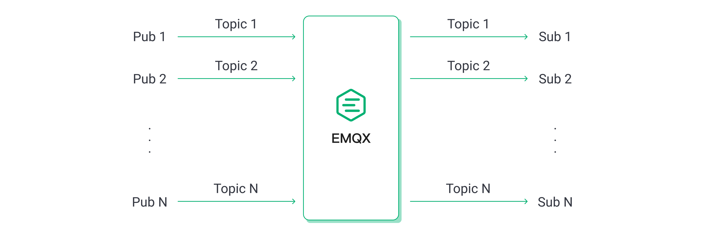
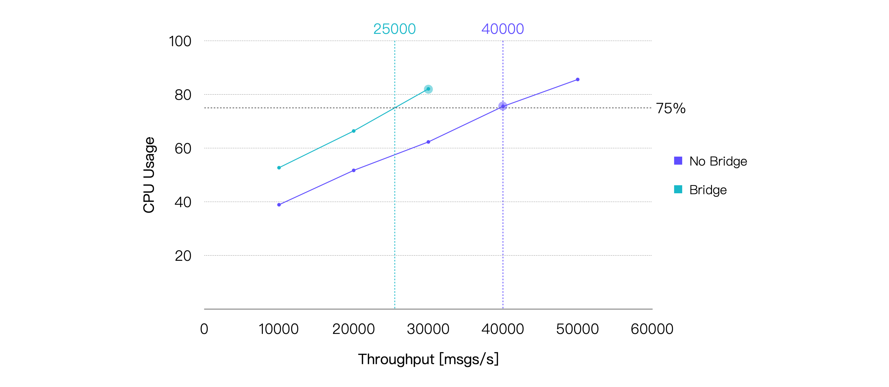
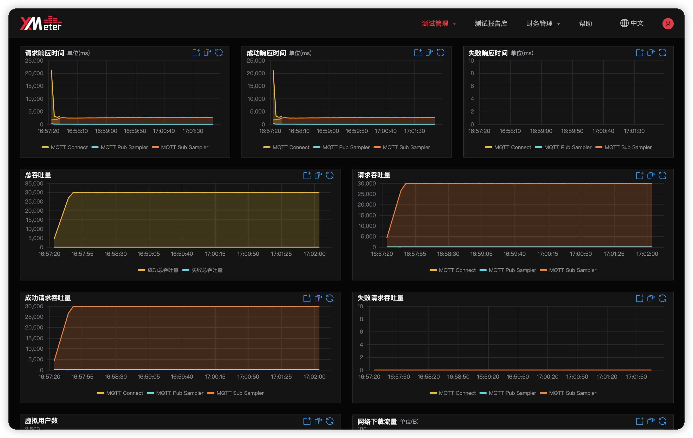
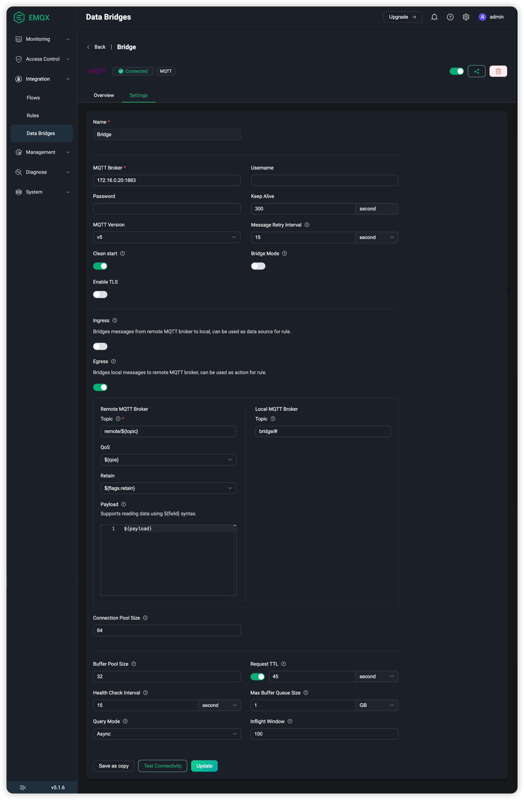
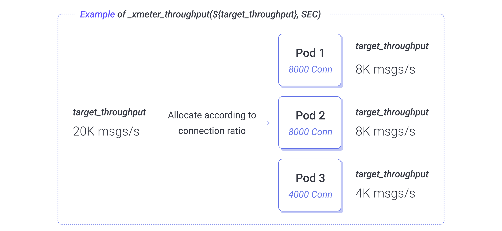

EMQX 是一款开源的大规模分布式 MQTT 消息服务器。由于其功能丰富，运行稳定，EMQX 尤其受泛物联网开发者和实时通信应用开发者的青睐。EMQX 5.0 单集群支持高达 1 亿的 MQTT 并发连接数，单服务器的传输与处理吞吐量可达每秒百万级 MQTT 消息，并保证延迟在毫秒级。

## 评估 MQTT 消息服务性能的重要性

在实际的业务场景中，有很多因素都会影响 MQTT 消息传输的性能，例如硬件资源、操作系统参数、通信时使用的 QoS 等级、消息大小等等。这些因素的叠加和组合使得真实的场景千变万化，我们无法仅仅发布一些简单的性能测试报告来概括这些繁杂的场景。用户在进行架构设计与技术选型前需要有更贴合其实际场景的性能测试数据作为参考。

因此相比于发布性能数据，对 EMQ 来说更重要的是帮助用户掌握对 MQTT Broker 进行性能测试的方法。

为了降低测试难度、提高测试效率，本教程中我们将使用全托管的 MQTT 负载测试云服务 —— XMeter Cloud。XMeter Cloud 提供了连接测试、消息吞吐测试等标准测试场景，用户可以很方便地对测试进行参数化配置。除此之外，它也支持上传自定义脚本来实现对任意场景的测试。

你也可以使用开源的 JMeter 构建测试环境，本教程中的方案可以与 JMeter 兼容。

## 测试场景与测试结果

我们使用 XMeter Cloud 测试了 EMQX 在几个典型场景下的性能变化曲线，以便你直观地了解到 EMQX 在这些场景下的基准性能，以及 QoS 等级，Payload 大小这些因素对于 MQTT 性能的实际影响。

本次测试结果基于 **EMQX v5.1.6 开源版本**，并使用华为云 ECS 作为服务器，配置如下：

- **实例类型**：通用计算增强型 c7
- **规格名称**：c7.xlarge.2
- **CPU**：4vCPUs (Intel Xeon Platinum 8378A CPU @ 3.00GHz)
- **内存**：8 GiB
- **硬盘**：通用型 SSD | 40 GiB
- **最大带宽**：8 Gbit/s
- **最大内网收发包**：80万 PPS（Packets Per Second）
- **操作系统**：CentOS 7.9

另外，除扇入场景下 XMeter Cloud 使用了 20 台测试机来发布和接收消息以外，其余场景下的测试机数量均为 10 台。

### 测试 1：EMQX 处理不同 QoS 时的性能表现

QoS 等级越高，对应的 MQTT 报文交互流程也越复杂，所以传递该 QoS 消息所消耗的系统资源也会更多。不同的 QoS 之间的性能差距到底如何，是开发者一直都很关心的问题。

在本场景中，1,000 个发布者和 1,000 个订阅者使用 Payload 大小为 128 字节的消息进行一对一通信。一共存在 1,000 个主题，但每个主题都只会有一个发布者和一个订阅者。



我们以逐渐增大消息发布速率的方式来增加负载，EMQX 会在每个负载下运行 5 分钟以观察运行的稳定性。我们记录了不同 QoS 级别，不同负载下的 EMQX  性能表现和资源占用情况，包括但不限于：平均消息延迟、P99 消息延迟、CPU 平均占用率。

最终测试结果如下：


> Latency 指消息从发布到被接收所花费的时间。Throughput 包含消息流入与流出。

可以看到，QoS 等级越高，相同负载下 CPU 的平均占用率也就越高，因此在同样的系统资源条件下，更高的 QoS 通常意味着相对更低的吞吐。

如果我们将平均 CPU 占用率在 75% 左右时的负载作为推荐的日常负载，那么我们可以得出：在当前的硬件规格以及测试场景下，QoS 0 的推荐负载约为 57K TPS，QoS 1 的推荐负载约为 40K TPS，QoS 2 的推荐负载约为 24K TPS。以下是 CPU 占用与 75% 最接近的测试点的性能数据：

| **QoS Level** | **Recommended Workload, TPS (In + Out)** | **Average CPU Usage, % (1 - Idle)** | **Average Memory Usage, %** | **Average Letancy, ms** | **P99 Letancy, ms** |
| :------------ | :------------------------------ | :---------------------------------- | :-------------------------- | :---------------------- | :------------------ |
| QoS 0         | 60K                             | 78.13                               | 6.27                        | 2.079                   | 8.327               |
| QoS 1         | 40K                             | 75.56                               | 6.82                        | 2.356                   | 9.485               |
| QoS 2         | 20K                             | 69.06                               | 6.39                        | 2.025                   | 8.702               |

### 测试 2：EMQX 处理不同 Payload 大小时的性能表现

消息的 Payload 越大，操作系统需要更多的软中断来接收和发送网络报文，EMQX 也需要花费更多的计算资源来序列化和反序列化消息，因此理论上最终的性能表现也会越差。

在大部分情况下，我们发送的消息都不会超过 1KB，但在某些场景下，传输更大的消息是必要的。所以在这个场景中，我们将测试 Payload 大小对性能的实际影响。

继续由 1,000 个发布者和 1,000 个订阅者进行一对一通信，但是将消息的 QoS 设置为 1，且发布速率固定为 20K msgs/s，通过增加 Payload 大小的方式增加负载，EMQX 同样将在每个负载下运行 5 分钟以确保稳定，我们记录 EMQX 在每个负载下的性能表现和资源占用情况。

测试结果如下：


随着 Payload 增大，CPU 占用率逐渐升高，消息的端到端延迟也随之出现较为平滑的增长。不过在 Payload 大小到达 8KB 时，我们仍然可以获得小于 10 毫秒的平均延迟以及小于 20 毫秒的 P99 延迟。

| **Payload Size, KB** | **Recommended Workload, TPS (In + Out)** | **Average CPU Usage, % (1 - Idle)** | **Average Memory Usage, %** | **Average Letancy, ms** | **P99 Letancy, ms** |
| :------------------- | :---------------- | :---------------------------------- | :-------------------------- | :---------------------- | :------------------ |
| 1                    | 40K               | 75.9                                | 6.23                        | 3.282                   | 12.519              |
| 8                    | 40K               | 90.82                               | 9.38                        | 5.884                   | 17.435              |

这也向我们说明了另一件事情，除了 QoS 等级以外，我们同样需要注意性能测试报告中使用的 Payload 大小，如果我们实际使用的 Payload 大小远远大于报告中使用的值，这意味着我们所需要的硬件规格也会更高。

### 测试 3：EMQX 在不同发布订阅模式下的性能表现

MQTT 的发布订阅机制使我们可以很轻松地调整消息的发布和订阅模式，来满足不同业务场景的需要，例如大量传感器设备作为发布者，少量甚至单个后端应用程序作为订阅者存储或分析传感器数据的这类扇入场景，或者消息广播这类少量发布者大量订阅者的扇出场景，又或者是发布者与订阅者需要一对一通信的对称场景。

但 MQTT Broker 在不同发布订阅模式下的性能表现通常也会存在细微的不同，接下来我们将通过实际的测试来验证这一点。

对称场景与前面保持一致。扇入场景下，我们设置 2,000 个发布者和 100 个订阅者，每 100 个发布者的消息由 5 个订阅者以共享订阅方式消费。


扇出场景下，我们设置 10 个发布者和 2,000 个订阅者，每个发布者的消息由 200 个订阅者以普通订阅方式消费。


由于扇出场景下消息流入相比其他两个场景更少，因此我们将总吞吐量一致或接近视为相同负载然后进行对比。例如扇出场景下消息流入 100 msgs/s，流出 20K msgs/s，便等同于对称场景下消息流入 10K msgs/s，流出 10K msgs/s。

保持消息的 QoS 等级为 1，Payload 大小为 128 字节，最终测试结果如下：


如果仅看消息延迟，三种场景的性能表现其实非常接近。但实际上在相同的负载下，扇出场景消耗的 CPU 总是更低。所以如果我们以 75% 的 CPU 占用率为界限，就能比较直观地看到，相比于另外两个场景，扇出可以达到更高的负载：


| **Scene** | **Recommended Workload, TPS (In + Out)** | **Average CPU Usage, % (1 - Idle)** | **Average Memory Usage, %** | **Average Letancy, ms** | **P99 Letancy, ms** |
| :-------- | :------------------------------ | :---------------------------------- | :-------------------------- | :---------------------- | :------------------ |
| Fan-In    | 30K                             | 74.96                               | 6.71                        | 1.75                    | 7.651               |
| Fan-Out   | 50K                             | 71.25                               | 6.41                        | 3.493                   | 8.614               |
| Symmetric | 40K                             | 75.56                               | 6.82                        | 2.356                   | 9.485               |

### 测试 4：EMQX 在桥接时的性能表现

MQTT 桥接可以将一个 MQTT 服务器中的消息桥接至另一个服务器，常见的使用场景包括将边缘网关汇聚的消息桥接至云端服务器以及令消息在两个 MQTT 集群间流通。

在这个测试场景中，连接到 MQTT 服务器 1 的 500 个发布端发布的消息，会被桥接到 MQTT 服务器 2，被连接到该服务器的 500 个订阅端接收。而连接到 MQTT 服务器 2 的另外 500 个发布端 发布的消息，则会被连接到 MQTT 服务器 2 的 500 个订阅端接收。

这将保证在客户端的消息发布速率相同的情况下，EMQX 中消息流入流出的速率将与未配置桥接的对称场景接近，以便我们对比两者的性能差异。


保持消息的 QoS 等级为 1，Payload 大小为 128 字节，最终测试结果如下：




桥接在消息投递的过程中引入了一个额外的中转，所以消息的端到端延迟将会增加。另外，桥接也会带来额外的 CPU 消耗。我们的测试结果也印证了这两点。取平均 CPU 占用率在 75% 左右时的负载，即约 25K TPS 作为桥接场景在本次测试的硬件规格下的推荐负载，CPU 占用与之相差最小的测试点的测试结果如下：

| **Recommended Workload, TPS (In + Out)** | **Average CPU Usage, % (1 - Idle)** | **Average Memory Usage, %** | **Average Letancy, ms** | **P99 Letancy, ms** |
| :------------------------- | :---------------------------------- | :-------------------------- | :---------------------- | :------------------ |
| 30K                        | 82.09                               | 5.6                         | 5.547                   | 17.004              |

接下来，我们将尽可能详细地介绍使用到的测试工具以及测试步骤，以便你搭建自己的测试环境并复现本文中的所有测试用例，或者测试其他任何你需要的场景。

## 测试工具

在本文的测试中，我们用到了以下软件或工具：

1. [EMQX](https://www.emqx.io/)，一款开源的大规模分布式 MQTT 消息服务器，专为物联网和实时通信应用而设计。
2. [XMeter Cloud](https://www.emqx.com/en/products/xmeter)，全托管的 MQTT 负载测试云服务，基于 Apache 开源项目 JMeter 构建，可以快速运行各种 MQTT 负载和场景测试。
3. [collectd](https://github.com/collectd/collectd)，一个运行在系统上的守护进程，它可以收集CPU、内存、磁盘使用情况、网络数据等信息，并将这些数据发送到指定的数据存储中。
4. [InfluxDB](https://www.influxdata.com/)，一个用于存储和分析时间序列数据的开源时序数据库。
5. [Grafana](https://grafana.com/grafana/)，一个开源的数据可视化和监控工具，它可以将来自各种数据源的数据转换成美观的图表、图形和警告。

## 搭建测试环境

首先我们需要在华为云上创建两个 ECS 实例，实例类型为**通用计算增强型 c7**。

其中一台服务器用来运行 EMQX 和 collectd，另一台服务器则用来运行 InfluxDB 和 Grafana。

collectd 负责收集 EMQX 所在机器的 CPU 占用等系统指标，然后把这些指标发送给部署在另一台服务器上的 InfluxDB，InfluxDB 会将这些数据存储下来。最后，Grafana 将 InfluxDB 作为数据源，以图表的方式展示这些指标数据。


接下来，我们需要先在这两台云主机上完成这些软件的安装与配置，然后再从 XMeter Cloud 发起 MQTT 测试。

在这个过程中，我们将用到一些文件，例如 Grafana Dashboard 的模板文件和在 XMeter Cloud 使用的测试脚本，你可以在当前目录中找到它们。

### 1. 安装并配置 EMQX

在 Server 1 中下载并安装 EMQX v5.1.6 版本：

```
wget https://www.emqx.com/en/downloads/broker/5.1.6/emqx-5.1.6-el7-amd64.rpm
sudo yum install emqx-5.1.6-el7-amd64.rpm -y
```

安装完成后即可启动 EMQX，在本文所有的性能测试中，如果没有特别说明，EMQX 均以默认配置运行：

```
sudo systemctl start emqx
```

### 2. 安装并配置 collectd

在 Server 1 中安装 collectd：

```
yum install collectd -y
```

我们将用到 CPU, Load, Interface, Memory 这四个插件，它们分别用来收集 CPU 占用、CPU 负载、网络流量和内存占用这些系统指标。这些插件默认启用，我们可以在配置文件 `/etc/collectd.conf` 中找到以下配置：

```
LoadPlugin cpu
...
LoadPlugin interface
...
LoadPlugin load
...
LoadPlugin memory
```

collectd 的 CPU 插件默认报告每个核的 CPU 使用情况，并且使用的是 CPU Jiffies，我们希望它直接报告所有核平均后的百分比，所以我们需要在配置文件中添加以下配置：

```
<Plugin cpu>
  ReportByCpu false
  ReportByState true
  ValuesPercentage true
</Plugin>
```

接下来，我们还需要配置 collectd 的 network 插件，让 collectd 将收集到的性能指标发送给另一台服务器上的 InfluxDB，我们需要在 `/etc/collectd.conf` 中添加以下配置，启用 network 插件并将性能指标发送到指定的 Host 和端口：

```
LoadPlugin network
<Plugin network>
  Server "172.16.0.210" "25826"
</Plugin>
```

完成以上配置后，我们启动 collectd：

```
systemctl start collectd
```

### 3. 安装并配置 InfluxDB

在 Server 2 中安装 InfluxDB 1.8：

```
wget https://dl.influxdata.com/influxdb/releases/influxdb-1.8.10.x86_64.rpm
sudo yum localinstall influxdb-1.8.10.x86_64.rpm -y
```

请勿安装 InfluxDB 2.7 及以上的版本，这些版本不再直接支持 collectd、Prometheus 等备用写入协议，必须使用 Telegraf 将这些协议转换成 Line Protocol 再写入到 InfluxDB 中。所以为了简单起见，我们直接安装支持 collectd 写入协议的 InfluxDB 1.8。

接下来，我们需要修改 InfluxDB 的配置让它能够接收 collectd 发送的性能指标并存储至数据库。打开 InfluxDB 的配置文件 `/etc/influxdb/influxdb.conf`，将 `collectd` 部分的配置项改为以下内容：

```
[[collectd]]
  enabled = true
  bind-address = ":25826"
  database = "collectd"
  batch-size = 5000
  batch-pending = 10
  batch-timeout = "10s"
  read-buffer = 0
  typesdb = "/usr/share/collectd/types.db"
  security-level = "none"
  parse-multivalue-plugin = "split"
```

以上配置表示 InfluxDB 将监听 25826 端口上的 collectd 数据，并将其写入到名为 collectd 的数据库，该数据库由 InfluxDB 自动创建。

`typesdb` 是必须的，它指向一个 `types.db` 文件，这个文件定义了 collectd 数据源规范，InfluxDB 需要通过这个文件来理解 collectd 的数据。我们可以在当前机器中安装 collectd 来获取这个文件，`/usr/share/collectd/types.db` 就是以 yum 方式安装 collectd 时 `types.db` 文件的默认路径，或者我们也可以从 [这里](./types.db) 获取 `types.db`。

`security-level` 设置为 `none` 表示 collectd 数据不会经过签名和加密，与我们在 collectd 中的配置保持一致。

`parse-multivalue-plugin` 设置为 `split` 表示 InfluxDB 会将具有多个值的数据分开存储为多个数据点。

接下来，启动 InfluxDB：

```
sudo systemctl start influxdb
```

我们可以通过以下命令来验证 collectd 的数据是否正确地写入了 InfluxDB：

```
$ influx
Connected to http://localhost:8086 version 1.8.10
InfluxDB shell version: 1.8.10
> use collectd
Using database collectd
> select * from cpu_value limit 8
name: cpu_value
time                host     type    type_instance value
----                ----     ----    ------------- -----
1692954741571911752 ecs-afc3 percent user          0.049981257028614265
1692954741571917449 ecs-afc3 percent system        0.024990628514307132
1692954741571923666 ecs-afc3 percent wait          0.024990628514307132
1692954741571932372 ecs-afc3 percent nice          0
1692954741571943586 ecs-afc3 percent interrupt     0
1692954741571947059 ecs-afc3 percent softirq       0
1692954741571947389 ecs-afc3 percent steal         0
1692954741571949536 ecs-afc3 percent idle          99.90003748594276
```

### 4. 安装并配置 Grafana

在 Server 2 中安装 Grafana：

```
sudo yum install -y https://dl.grafana.com/oss/release/grafana-10.0.0-1.x86_64.rpm
```

启动 Grafana：

```
systemctl start grafana-server
```

接下来，我们需要在 Grafana 中导入一个提前准备好的 Dashboard，这个 Dashboard 会提供 CPU 占用率、CPU 负载、内存占用率和网络流量四个监控面板，点击 [这里](./Grafana-Dashboard.json) 下载 Dashboard 模板文件。

在导入 Dashboard 前，我们还需要对 `Grafana-Dashboard.json` 文件稍作修改。因为我们在 Grafana 的 Dashboard 的每个 Query 中都添加了对 host 字段的判断以便在存在多个主机数据来源时进行区分。

在 `Grafana-Dashboard.json` 文件中搜索 `host::tag`，我们将找到以下内容：

```
...
{
  "condition": "AND",
  "key": "host::tag",
  "operator": "=",
  "value": "ecs-afc3"
}
...
```

将 `ecs-afc3` 这个主机名全局替换为我们自己的主机名即可。我们可以运行以下命令来查看主机名：

```
cat /proc/sys/kernel/hostname
```

然后，打开浏览器在地址栏输入 `http://<hostname>:3000` 以访问 Grafana，`<hostname>` 需要替换成实际的服务器地址。

Grafana 的默认用户名和密码均为 `admin`，首次登录时 Grafana 会要求我们修改默认密码。完成登录后我们首先添加 InfluxDB 作为数据源，在首页点击 `Add your first data source`：


找到 InfluxDB 数据源，点击以添加此数据源并进入配置页面：


这里我们只需要关注三个配置项：

1. URL，InfluxDB 的 HTTP 服务默认监听 8086 端口，而 InfluxDB 与 Grafana 位于同一台服务器中，所以这里我们配置为 `http://localhost:8086` 即可。
2. Database，Grafana 将从该数据库中读取 collectd 数据，所以我们将它配置为 `collectd`。
3. HTTP Method，指定 Grafana 向 InfluxDB 查询数据时使用的 HTTP 方法，这里我们配置为 `GET` 即可。

完成配置后点击 `Save & test` 按钮，如果配置正确，你将看到 `datasource is working. 7 measurements found` 这个提示：


点击右上角的加号，选择 `Import dashboard`：


导入修改好的 `Grafana-Dashboard.json` 文件，并选择刚刚添加的 InfluxDB 数据源：


点击 `Import` 按钮完成导入，我们将看到以下四个监控图表，它们分别展示了当前服务器 CPU 占用率、内存占用率、网络收发流量以及 CPU 负载的变化情况：


### 5. 系统调优

根据实际的测试规模，我们可能还需要调整 Linux 内核参数和 EMQX 参数。例如当我们的MQTT 客户端连接数量超过 65535 时，我们通常需要调整 `fs.file-max` 等参数以增加 EMQX 能够打开的最大文件句柄数。而当消息吞吐量较大时，我们可能还需要调整发送和接收缓冲区的大小设置以获得更好的性能表现。你可以参考 EMQX 的 [系统调优](https://www.emqx.io/docs/zh/v5.3/performance/tune.html) 文档。

不过本文涉及到的所有测试用例，不管是客户端连接数量，还是消息吞吐量，都不需要额外对 Linux 内核参数进行调整。所以后文中的所有测试，均在以下默认参数下完成：

```
fs.file-max = 761816
fs.nr_open = 1048576 

net.core.somaxconn = 1024
net.ipv4.tcp_max_syn_backlog = 1024
net.core.netdev_max_backlog = 1000
net.core.rmem_max = 212992
net.core.wmem_max = 212992
net.ipv4.tcp_rmem = 4096 87380 6291456
net.ipv4.tcp_wmem = 4096 16384 4194304
net.ipv4.tcp_max_tw_buckets = 5000
```

### 6. 在 XMeter Cloud 中创建测试

注册并登录 [XMeter Cloud](https://www.emqx.com/en/products/xmeter)，在进入首页后，我们首先需要切换至 **专业版**。只有在专业版中，我们才能够创建自定义测试场景以及在 EMQX 与 XMeter Cloud 之间创建对等连接。XMeter Cloud 目前仅支持与华为云平台建立对等连接，我们可以联系 XMeter Cloud 的技术团队来帮助完成这项操作。未来 XMeter Cloud 将支持更多的公共云提供商。

在对等连接创建完成后，我们就可以点击 `创建场景` 上传我们自己编写的 JMeter 脚本并开始测试了。

整个测试过程中，我们将用到四个 JMeter 脚本：`Fan-In.jmx`、`Fan-Out.jmx`、`Symmetric.jmx`、`Symmetric-Bridge.jmx`，它们分别对应扇入、扇出、对称以及桥接场景。你可以在 [这里](./scripts) 下载这些脚本。

每个脚本都提供了自定义变量以便我们修改 QoS 等级、Payload 大小、消息发布速率等参数。所以当我们测试 MQTT Broker 在不同 QoS 下的性能曲线时，只需要 `Symmetric.jmx` 这一个脚本即可。

在提交测试前，XMeter Cloud 会要求我们配置以下参数：


- **测试名称**：XMeter Cloud 默认会将测试场景名与当前时间拼接后作为测试名称，你可以将它更改为任何你喜欢的名字，只要它不会让你在多个测试之间混淆。
- **测试时长**：设置本次测试的持续时间，这里我们将时长设置为 5 分钟。
- **虚拟用户总数**：设置每个线程组的虚拟用户数，也就是 MQTT 客户端的数量，线程组取决于脚本的实际内容。我们在 `Symmetric.jmx` 脚本中添加了一个用于发布消息的线程组 Pub 和一个用于接收消息的线程组 Sub。这里我们将 Pub 和 Sub 线程组的虚拟用户数均设置为 1000，所以总数就是 2000。
- **发压区域**：设置创建测试机并发起负载的 VPC。
- **Ramp-Up 时间**：设置测试脚本运行时需要在多少时间内到达我们设置的最大虚拟用户数，这里我们设置为 20 秒，即测试运行时将以每秒 100 连接的速率发起连接。
- **循环模式**：保持 `持续循环` 这一默认设置即可，即测试运行的时长将完全由 `测试时长` 参数决定。
- **XMeter 运行时变量**：这里列出的就是我们在测试脚本中定义的变量，这允许我们通过修改变量来实现对测试用例的微调，例如改变消息的 QoS 等级等等。以下是 `Symmetric.jmx` 脚本提供的自定义变量：
  - server：MQTT 服务器地址，在创建对等连接后这里需要配置为该服务器的内网地址。
  - host：MQTT 服务器的监听端口。
  - qos：消息被发布时使用的 QoS 等级。订阅者订阅的最大 QoS 固定为 2，确保不会发生消息降级。
  - payload_size：消息的 Payload 大小，单位为字节。
  - target_throughput：目标吞吐量，这里指的是消息的总发布速率。当我们将发布线程组的虚拟用户数设置为 1000，target_throughput 设置为 10000，那么每个发布端将以 10 msgs/s 的速率发布消息。
  - publisher_number 等：在 XMeter Cloud 中，这些变量会被前面的虚拟用户总数、Ramp-Up 时间等配置覆盖，所以无需关心。它们仅在我们直接使用 JMeter 发起测试时有效。

完成以上配置后，我们就可以点击 `下一步` 提交测试。在测试的运行过程中，我们可以在 XMeter Cloud 中观察吞吐量、响应时间的实时变化，在 Grafana Dashboard 中观察 EMQX 所在服务器的 CPU 等系统资源使用情况：



### 7. 桥接场景的额外配置

在桥接场景的测试中，我们需要一台额外的 EMQX 服务器。


在华为云上申请一个相同规格的 ECS 实例，参考前文的步骤安装 EMQX 和 collectd，然后在两个 EMQX 中分别配置出口方向的 MQTT 桥接，配置如下：



或者在配置文件 `emqx.conf` 中添加以下配置，注意 `server` 需要配置为另一个 EMQX 的主机地址：

```
bridges {
  mqtt {
    Demo {
      bridge_mode = false
      clean_start = true
      egress {
        local {topic = "bridge/#"}
        pool_size = 64
        remote {
          payload = "${payload}"
          qos = "${qos}"
          retain = "${flags.retain}"
          topic = "remote/${topic}"
        }
      }
      enable = true
      keepalive = 300s
      mode = cluster_shareload
      proto_ver = v5
      resource_opts {
        health_check_interval = 15s
        inflight_window = 100
        max_buffer_bytes = 1GB
        query_mode = async
        request_ttl = 45s
        worker_pool_size = "32"
      }
      retry_interval = 15s
      server = "172.16.0.20.1883"
      ssl {enable = false, verify = verify_peer}
    }
  }
}
```

当我们在 Server 3 中安装 collectd 并同样将数据转储到 InfluxDB 以后，我们需要在 Grafana 中创建一个新的 Dashboard 来展示 Server 3 的指标数据。与前文的步骤相同，修改 `Grafana-Dashboard.json` 文件中的主机名然后导入 Grafana 即可。

## 开源 JMeter 与 XMeter Cloud 在测试中的差异

所有我们在本文中用到的测试脚本，均可在 JMeter 中运行，我们只需要在 JMeter 中安装两个插件即可。它们分别是：

1. `mqtt-xmeter-2.0.2-jar-with-dependencies.jar`，这个插件为 JMeter 提供了 MQTT 协议的测试能力，我们可以添加 Connect Sampler、Pub Sampler 和 Sub Sampler 等 Sampler 来实现 MQTT 的连接、发布、订阅等操作。

2. `xmeter-plugins-common-0.0.6-SNAPSHOT.jar`，这个插件提供了一个 `__xmeterThroughput()` 函数，我们会在 Constant Throughput Timer 中用到它，它的作用是将我们配置的 `target_throughput` 转换为每分钟的目标吞吐量，然后按连接比例分配到各个测试机上，这在单个测试机无法提供目标负载时非常有用。

   

我们可以在 [这里](./jmeter-plugins) 下载这两个插件。

与 JMeter 相比，XMeter Cloud 自带图形化测试报告，我们可以清晰地看到各个指标的变化曲线，无需自行安装和配置额外的软件。另外，在大规模并发测试中，XMeter Cloud 可以自动分配与释放测试机，与使用 JMeter 相比，大幅度缩短了我们的准备周期。

不过需要注意，本文的测试均在 XMeter Cloud 的测试环境中完成。该测试环境与线上环境主要存在以下区别：

1. **从同步请求改为异步请求。** 这将更符合真实的负载情况，从而测得更准确的结果。
2. **消息延迟等数据的单位从毫秒改为微秒。** 当消息延迟低于 1 毫秒时我们可以看到实际的延迟时间，而不是 0。
3. **提供了 P95、P99 消息延迟数据。** 这可以更直观地衡量 EMQX 的性能表现。

以上变化都会在近期更新至 XMeter Cloud 正式环境。

## 总结

在本文中，我们看到了 EMQX 非常优秀的性能表现，在 4 核 8 GB 的硬件规格下，1000 个发布端和 1000 个订阅端使用 128 字节大小的 QoS 1 消息进行一对一通信，EMQX 可以在 60K TPS 的消息吞吐量下提供 15 毫秒左右的 P99 消息端到端延迟。

不过 EMQX 在不同场景下的性能曲线也向我们揭示了 QoS 等级、Payload 大小等因素对 MQTT Broker 性能的影响是切实存在的。所以，按照实际场景下的负载要求、硬件规格以及使用的功能组合，对 MQTT Broker 进行性能测试验证，也是非常有必要的。

一个合适的测试工具，可以帮助我们极大地提高测试效率，它需要能够模拟各种场景和配置，但在使用上不能太过复杂，也需要提供足够的指标帮助我们尽可能全面了解 MQTT Broker 的性能表现。所以在本文中，我们介绍了如何围绕 XMeter Cloud 来构建我们自己的测试平台，以及如何评估 MQTT Broker 的性能。

虽然本文的所有测试均使用了操作系统的默认内核参数，但在你的测试场景，可能需要调整一些参数来使系统获得更佳的性能表现。在你完成测试平台的搭建后，自行验证各个内核参数的效果也会变得非常简单。当然，我们也会在未来带来更多内核参数的优化建议。

 